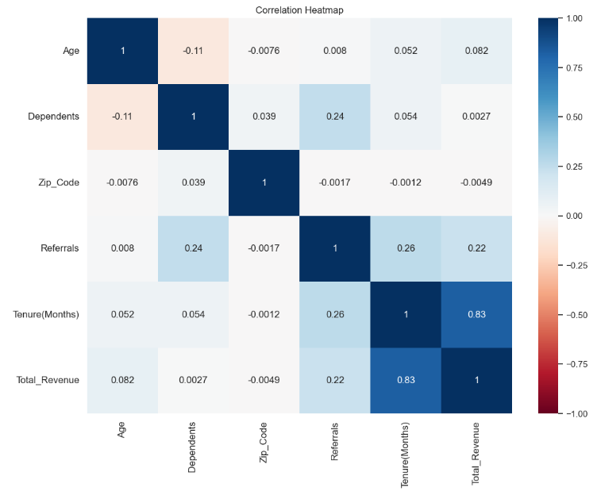
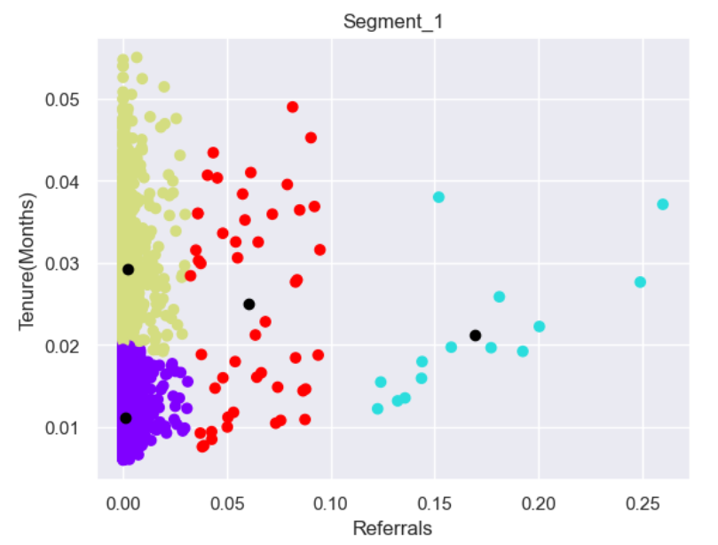
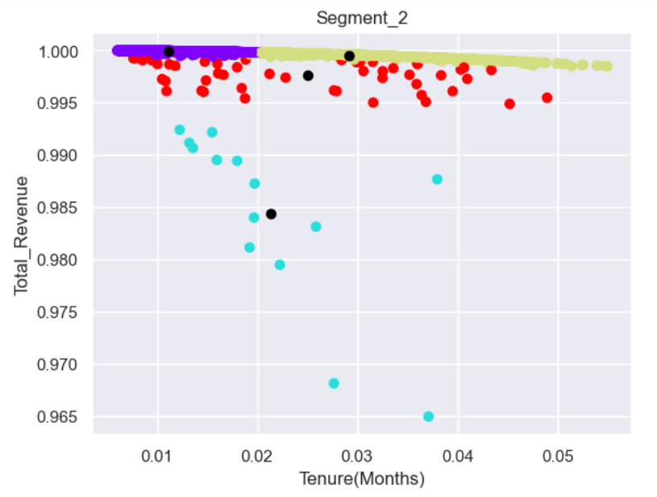

# Customer_Segmentation_Analysis

# Table of Contents
- [Case Study](#case-study)
- [Data Source](#data-source)
- [Tools](#tools)
- [Method of Analysis](#method-of-analysis)
- [Exploratory Data Analysis](#exploratory-data-analysis)
- [Hypothesis](#hypothesis)
- [Data Clustering](#data-clustering)
- [Findings and Recommendations](#findings-and-recommendations)
- [Code](#code)

# Case Study
A service providing company wants to identify its high-value customers in order to tailor and develop focused marketing campaigns as well as allocate resources more effectively.
# Data Source
The data was gotten from Maven Analytics Data Playground.[Link](https://mavenanalytics.io/data-playground?search=customer%20churn)
# Tools
### Python
Libraries and packages used:
- Pandas
- Numpy
- Matplotlib
- Seaborn
- Scipy
- Scikit-learn
# Method of Analysis
I conducted a customer segmentation based on value using the K-means clustering approach and applied an analytic pipeline which involved five stages:
- Importing the necessary libraries and packages and loading the dataset
- Data preprocessing which involved data cleaning and transformation
- Exploratory Data Analysis(EDA)
- Data clustering using K-means algorithm
- Clustering analysis and visualization
# Exploratory Data Analysis
After data cleaning and data transformation, I performed statistical analysis using the Pearson correlation coefficient method to detect if there were any relationships, associations or patterns present between variables in the dataset.

This visual representation shows that there is a strong positive relationship between the total revenue generated by customers and the length of time (tenure) spent with the company. There was also a slight correlation between the tenure of customers and the number of referrals brought to the company.
# Hypothesis
This is my assumption based on the findings of the EDA conducted:
- Customers that spend a significant number of time(tenure) with the company yield profitability for the company in terms of revenue.
It is therefore important to pinpoint these valuable customers and tailor marketing strategies to retain them.
# Data Clustering
I applied the unsupervised machine learning approach using K-means algorithm for the customer segmentation. The several steps of the algorithm are as follows:
- Utilized the Elbow method to determine the optimal number of clusters.
- Initialized K as the centroid randomly
- Calculated the Euclidean distance of every data point from every centroid in the space.
- Allocated every data point to the nearest centroid based on the calculated distance.
- Iterated until the centroids and data points remain the same and fixed.
Then I employed a scatter plot to depict each of the clusters delineated by the K-Means algorithm:

# Findings and Recommendations
## Segment_1
Insights:
- Cluster A: These customers represented with purple dots are fairly new to the company and don't have any referrals. This might be because they recently joined.
- Cluster B: These customers represented with yellow dots have longer tenures but have no referrals. This indicates a possibility of inactiveness or nonchalance.
- Cluster C: These customers represented with red dots range from those that joined newly to those with longer tenures who have more referrals. This shows that they are active and contribute significantly to the company.
- Cluster D: These customers represented with green dots are fairly new to the company but they also have more referrals. This also shows that they are active and contribute significantly to the company.

Marketing Strategy:
It's always less expensive to maintain an existing relationship than to create a new one. So, customers in Cluster C and D are valuable customers that show great potentials and should be targeted with strategies for retention. 
To retain these customers and encourage repeat business, the company could reward them for bringing in referrals, and offer loyalty programmes. These programmes can include rewards for long-term contracts, discounts, or exclusive access to new products and services. 
## Segment_2
Insights:
- Cluster A: These customers represented with purple dots are newer to the company but generate more revenue. This shows profitability and there are prospects for longevity.
- Cluster B: These customers represented with yellow dots have longer tenures and they also generate a lot revenue. This indicates that they are high-value customers.
- Cluster C: These customers represented with red dots range from those that newly joined to those with longer tenures, but they also generate a substantial amount of revenue. They also have the potential of being profitable customers.
- Cluster D: These customers represented with green dots have been with the company for some time but generate a bit lower revenue. There is the however the potential for growth among these customers as most of them are fairly new to the company.

Marketing Strategy:
Those customers that show high level of customer lifetime value (CLV), which is a measure of the average revenue generated over their entire relationship with the company should be provided compelling services that drive retention.
These users can then be passed over with regard to acquisition campaigns, saving budget that can be better spent elsewhere.
# Code
You can view the full code [here](Customer_Segmentation_Analysis.ipynb)
